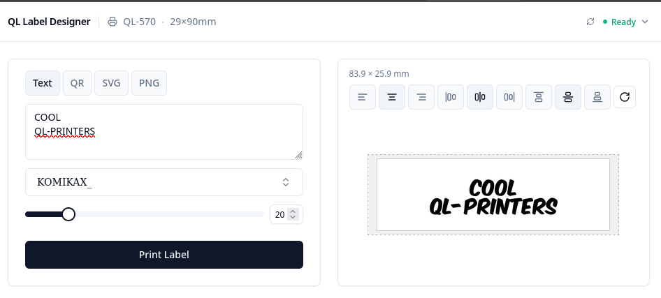

# goqlprinter

Web-based label printing interface for Brother QL thermal printers. Provides a React frontend and Go backend with a REST API for printing text, QR codes, SVG, and PNG labels.


## Features

- Print text labels with font and alignment control
- Multiline text with per-line alignment
- Generate and print QR codes
- Print SVG and PNG images
- Live label preview before printing
- Auto-discovers connected Brother QL printers
- 20+ label sizes (endless tape, die-cut, round)
- CLI interface alongside the web UI



## Supported Printers

Brother QL-500, 550, 560, 570, 580N, 650TD, 700, 710W, 720NW, 800, 810W, 820NWB, 1050, 1060N, 1100, 1110NWB

## Requirements

- Go 1.24+
- Node.js 18+ (frontend build)
- [`just`](https://github.com/casey/just) (build tool)
- USB access permissions for direct printer communication

## Getting Started

```bash
# Install frontend dependencies
just install-frontend

# Run development server (Go backend + Vite dev server)
just dev
```

This starts two servers concurrently:
- **http://localhost:5173** — Vite frontend with hot reload (use this in dev)
- **http://localhost:8000** — Go backend API

Open http://localhost:5173 in your browser during development. In production, the binary serves everything from port 8000.

## Building

```bash
# Build for current platform
just build

# Cross-compile for all platforms
just build-all
```

| Target | Command |
|--------|---------|
| Linux | `just build-linux-native` |
| Linux (ARM64) | `just build-linux-arm-native` |
| Windows | `just build-windows-native` |
| macOS (amd64 + arm64) | `just build-darwin-native` |

The binary embeds the frontend — no separate web server needed.

The native builds use OS printer interfaces and work with standard printer drivers. Printer status reporting varies by platform:

| Platform | Printing | Status reporting |
|----------|----------|------------------|
| Linux | Full | Full (bidirectional `/dev/usb/lp*`) |
| macOS | Full | Basic (printer state via CUPS/IPP, no media info) |
| Windows | Full | Minimal (connection status only, no detailed errors) |

<details>
<summary>Advanced: USB (libusb) builds</summary>

USB builds communicate directly with the printer over USB, bypassing OS drivers. This gives full bidirectional status reporting on all platforms, but requires CGO, libusb-dev, and that no OS driver claims the device.

| Target | Command |
|--------|---------|
| Linux USB | `just build-linux-usb` |
| Windows USB | `just build-windows-usb` |

Windows USB builds require replacing the Brother driver with WinUSB using [Zadig](https://zadig.akeo.ie/).
</details>

## Configuration

Configuration is loaded in priority order (highest wins):

1. `LABELPRINTER_*` environment variables
2. `./config/config.json`
3. `~/.labelprinter/config.json`
4. `/etc/labelprinter/config.json`
5. Defaults

Example `config.json`:

```json
{
  "port": 8000,
  "printer": "auto",
  "model": "QL-700",
  "label_size": "62"
}
```

## CLI Usage

```bash
# Start the web server
./goqlprinter serve

# List connected printers
./goqlprinter printers

# Print text directly
./goqlprinter print "Hello, World!" -l 62

# List available label sizes and fonts
./goqlprinter labels
./goqlprinter fonts
```

## USB Permissions (Linux)

Add a udev rule so the printer is accessible without root:

```
SUBSYSTEM=="usb", ATTR{idVendor}=="04f9", MODE="0666"
```

Save to `/etc/udev/rules.d/50-brother-ql.rules` and reload: `sudo udevadm control --reload-rules`

## Windows

Works with the standard Brother printer driver — no extra setup needed.

## API

The server exposes a REST API at port 8000 (default):

| Method | Endpoint | Description |
|--------|----------|-------------|
| GET | `/api/printers` | List connected printers |
| GET | `/api/label-sizes` | List supported label sizes |
| GET | `/api/fonts` | List available fonts |
| POST | `/api/print` | Print text label |
| POST | `/api/print_qr` | Print QR code |
| POST | `/api/print_svg` | Print SVG |
| POST | `/api/print_png` | Print PNG |
| POST | `/api/preview` | Get PNG preview |
| POST | `/api/status` | Query printer status |

Swagger UI available at `/swagger/index.html`.

## Debug Mode

Set `"printer": "file"` in any print request to write the rasterized image to `debug_output/` instead of sending it to a printer.

## License

MIT — see [LICENSE](LICENSE)
