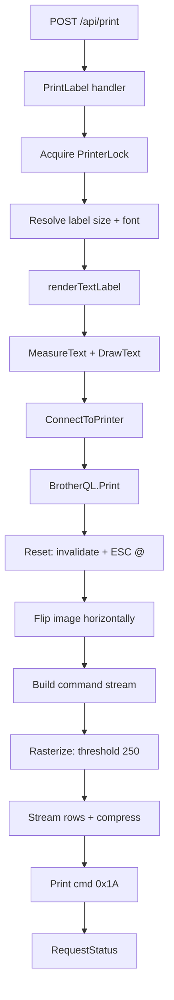

# Data Flow

## Print Pipeline



## Key Structures

```yaml
PrintRequest:
  Text: string
  LabelSize: string      # e.g. "62"
  FontFamily: string
  FontSize: float64
  Printer: string         # name/UID/"file"
  Model: string
  Orientation: string     # portrait/landscape
  Alignment: string       # center/start/end
  SVGData: string         # optional SVG content
  Scale: float64

PrinterModel:
  RasterWidthBytes: int   # 90 (standard) or 162 (wide)
  SupportsSwitchMode: bool
  SupportsCompression: bool
  InvalidateBytes: int    # 200-400

LabelSize:
  DotsTotalWidth: int
  DotsPrintableWidth: int
  DotsPrintableHeight: int  # 0 = endless
  TapeSizeWidth: int        # mm
  FeedMargin: int           # 35 (endless) or 0 (die-cut)

PrinterStatus:              # 32-byte response
  Ready/Busy/Error: bool
  MediaType/Width/Length: int
```

## Debug Mode

`printer: "file"` → saves PNG to `debug_output/` instead of printing
